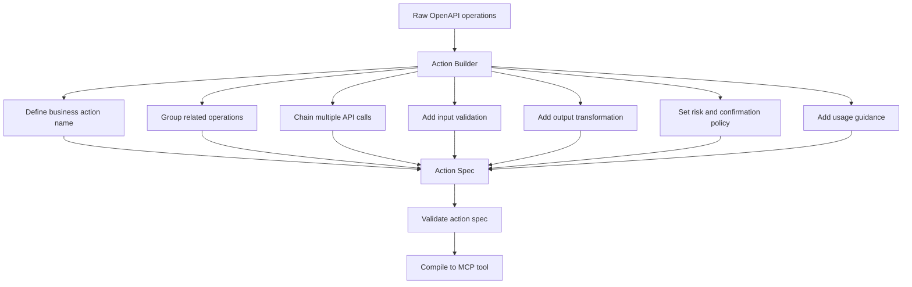
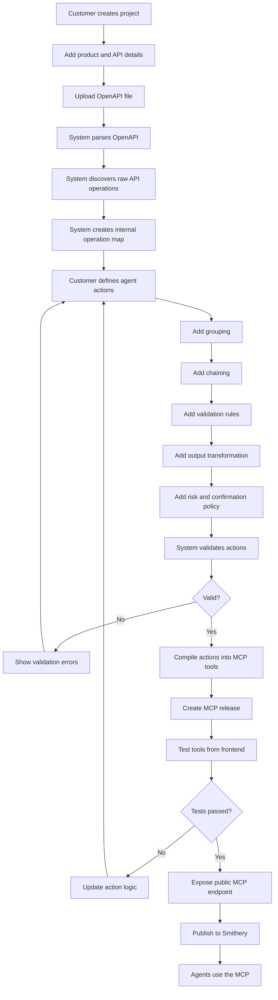
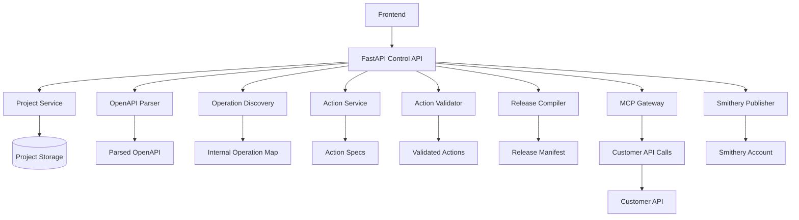
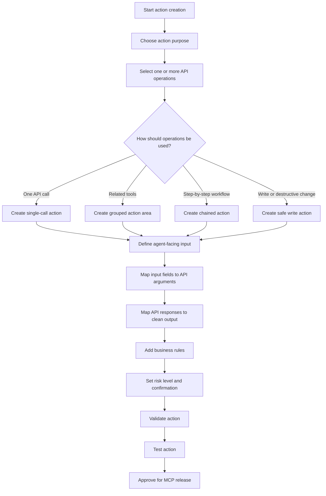
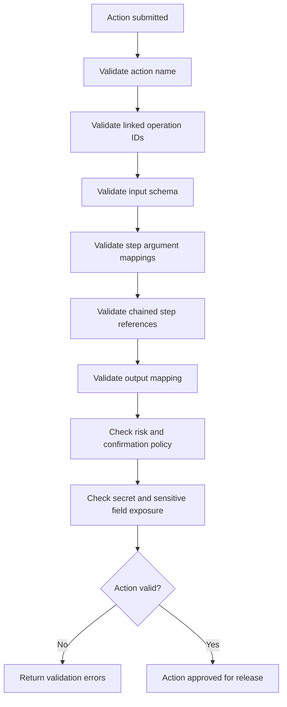
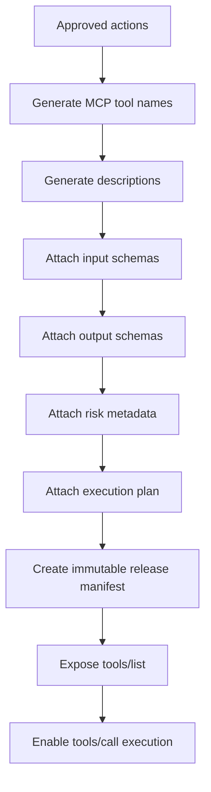
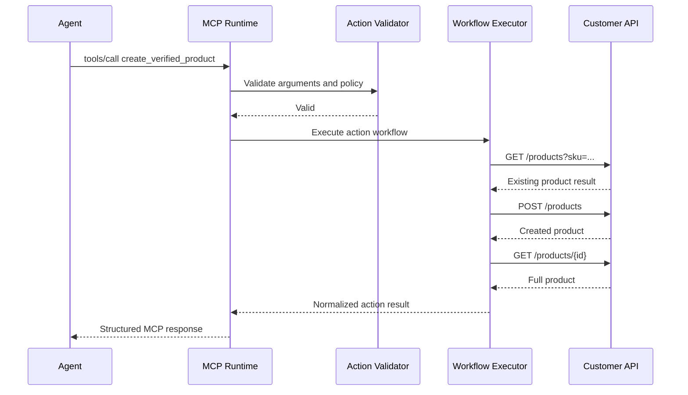
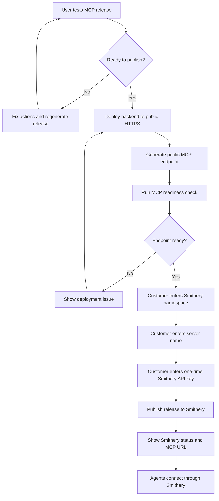

# Agent Action System Flow

## Purpose

This document explains the new Product-to-MCP system flow.

The product is moving from a simple API-to-MCP wrapper into an Agent Action MCP
Builder. Customers will still provide their product API and OpenAPI file, but
the final MCP tools will be generated from business-level actions instead of
raw API endpoints.

The goal is to make MCP servers useful for AI agents by exposing clear,
validated, safe, and task-oriented tools.

## Current prototype vs new system

The current prototype is a foundation. It proves this pipeline:

```text
Customer API -> OpenAPI discovery -> MCP tool generation -> testing -> Smithery publishing flow
```

The limitation is that the generated tools are still mostly direct API
wrappers. That means the agent sees backend operations instead of product
actions.

The new system changes the pipeline to:

```text
Customer API -> OpenAPI discovery -> agent action design -> action validation -> MCP generation -> testing -> Smithery publishing flow
```

The most important change is the action-design step. That is where raw
operations become useful MCP capabilities.

## Core idea

The current prototype follows this model:

```text
OpenAPI operation -> MCP tool
```

Example:

```text
GET /products        -> listproducts
POST /products       -> createproduct
PATCH /products/{id} -> updateproduct
DELETE /products/{id}-> deleteproduct
```

The new system follows this model:

```text
API operations -> Agent actions -> Validated workflows -> MCP tools
```

Example:

```text
GET /products
POST /products
PATCH /products/{id}
DELETE /products/{id}

become:

search_product_catalog
create_verified_product
update_product_price_safely
archive_product
generate_product_summary
```

This makes the MCP behave like an agent-facing frontend for the product. The
human frontend is designed for humans. The MCP frontend is designed for models
and agents.

## What an agent action is

An agent action is the main product object in the new system.

It is not just an API endpoint. It is a business task that an AI agent can
understand and execute safely through MCP.

An action can contain:

- A business-focused name.
- A clear purpose.
- When the agent should use it.
- When the agent should not use it.
- Input schema for the agent.
- Output schema returned to the agent.
- One or more linked API operations.
- Step-by-step execution logic.
- Validation rules.
- Response transformation rules.
- Risk level.
- Confirmation requirement.
- Error handling rules.

This is the layer that makes the generated MCP useful. OpenAPI tells us what
the API can technically do. Agent actions tell us what the agent should do with
that API.

## Action layer flow



## From raw API tools to proper MCP actions

The current prototype can generate tools like this:

```text
listProducts
createProduct
updateProduct
deleteProduct
```

These are direct API wrappers. They expose the backend shape to the agent.

The new system should generate tools like this:

```text
search_product_catalog
create_verified_product
update_product_pricing_after_validation
archive_product_safely
generate_product_summary
```

These are agent actions. They expose product tasks to the agent.

| Current wrapper tool | New agent action | Why it is better |
| --- | --- | --- |
| `listProducts` | `search_product_catalog` | Clearer intent and search-focused inputs. |
| `createProduct` | `create_verified_product` | Can check duplicate SKU before creation. |
| `updateProduct` | `update_product_pricing_after_validation` | Can validate price change and require confirmation. |
| `deleteProduct` | `archive_product_safely` | Avoids dangerous permanent deletion by default. |
| multiple raw reads | `generate_product_summary` | Returns a compact result instead of raw API payloads. |

## Complete product workflow

This is the main product flow from project creation to a usable MCP in
Smithery.



### Step 1: Customer creates project

The customer starts by creating a new Product-to-MCP project.

The project represents one product API that will eventually become one MCP
server.

User provides:

- Product name.
- Product description.
- Intended MCP users.
- Environment, such as staging or production.
- Desired MCP server name.

System does:

- Creates project record.
- Assigns project ID.
- Prepares the workspace for API import, action design, testing, and release.

Example:

```text
Project name: Demo Store
MCP server name: demo-store-mcp
Environment: staging
```

### Step 2: Customer adds API details

The customer adds the API connection details.

User provides:

- API base URL.
- Authentication type.
- API key or bearer token if required.
- API environment/version details.

System does:

- Stores non-secret API configuration.
- Stores credentials securely on the server side.
- Checks that the base URL is valid.
- Prepares the connection for future test calls.

Important: credentials should never be placed inside the OpenAPI file,
frontend logs, generated MCP manifest, or model-visible responses.

### Step 3: Customer uploads OpenAPI file

The customer uploads an OpenAPI 3.0 or 3.1 JSON/YAML file.

User provides:

- OpenAPI file for the product API.

System does:

- Reads the file.
- Parses JSON/YAML.
- Validates that it is a supported OpenAPI document.
- Rejects invalid or unsupported files with clear errors.

The OpenAPI file tells the system what API operations technically exist.

### Step 4: System discovers raw API operations

The backend scans the OpenAPI document and extracts all supported operations.

System discovers:

- HTTP method.
- API path.
- Operation ID.
- Summary and description.
- Path parameters.
- Query parameters.
- Header parameters.
- Request body schema.
- Response information where available.

Example discovered operations:

```text
GET /products
POST /products
GET /products/{product_id}
PATCH /products/{product_id}
DELETE /products/{product_id}
```

At this stage, these are still raw API operations. They are not the final MCP
tools.

### Step 5: System creates internal operation map

The system converts discovered OpenAPI operations into an internal operation
map.

The operation map is used as the backend building block for actions.

System stores:

- Stable operation ID.
- Method and path.
- Input schema.
- Request body schema.
- Supported/unsupported status.
- Reason if unsupported.

Example:

```text
operation_id: createProduct
method: POST
path: /products
input source: request body
```

This operation map is internal. Agents should not directly see every raw
operation by default.

### Step 6: Customer defines agent actions

This is the most important step in the new system.

The customer defines what agents should actually do with the product. These
agent actions are created from one or more raw API operations.

User defines:

- Action name.
- Action title.
- Action description.
- Group or business area.
- When the action should be used.
- When it should not be used.
- Input schema.
- Linked API operations.
- Execution steps.
- Business rules.
- Output mapping.
- Risk level.
- Confirmation requirement.

Example:

```text
Raw operations:
- listProducts
- createProduct
- getProduct

Agent action:
create_verified_product
```

The action can internally check if the product exists, validate the new
product, create it, fetch it again, and return a clean result.

### Step 7: Add grouping

Grouping organizes actions by business capability.

User defines:

- Group name.
- Which actions belong to the group.

Example:

```text
Product Management
- search_product_catalog
- create_verified_product
- update_product_pricing_after_validation
- archive_product_safely
```

System does:

- Uses the group to organize action review.
- Helps prevent a random flat list of raw tools.
- Keeps the MCP surface easier for agents and humans to understand.

Grouping does not call the API by itself. It improves structure and
understanding.

### Step 8: Add chaining

Chaining allows one action to execute multiple API operations in sequence.

User defines:

- Step order.
- Which API operation each step calls.
- How input fields map into each step.
- How previous step output maps into the next step.
- Conditions for running or stopping a step.

Example:

```text
create_verified_product
1. GET /products?sku={{ input.sku }}
2. Stop if product already exists.
3. POST /products with product body.
4. GET /products/{created_id}
5. Return clean product result.
```

System does:

- Executes steps deterministically.
- Prevents the agent from guessing the API call order.
- Stops the workflow if a required step fails.
- Returns a clear success or failure result.

### Step 9: Add validation rules

Validation ensures the action input is correct before the API is called.

User defines:

- Required fields.
- Field types.
- Allowed values.
- Business constraints.
- Required relationships between fields.

Example:

```text
- sku is required
- name is required
- price must be greater than 0
- price change above 50 percent requires confirmation
```

System does:

- Validates the action schema.
- Validates runtime tool arguments.
- Blocks invalid requests before calling the customer API.
- Returns clear validation errors to the MCP client.

### Step 10: Add output transformation

Output transformation controls what the agent receives after execution.

User defines:

- Which API response fields should be returned.
- Field renaming.
- Summary fields.
- Sensitive fields to hide.
- Final response shape.

Example raw API response:

```json
{
  "id": "p_456",
  "name": "Growth Plan",
  "price": 79,
  "internal_notes": "private",
  "created_by": "admin_user"
}
```

Example MCP response:

```json
{
  "product_id": "p_456",
  "name": "Growth Plan",
  "price": 79,
  "status": "created"
}
```

System does:

- Removes unnecessary fields.
- Redacts sensitive fields.
- Converts raw API output into clean structured MCP output.
- Makes the result easier for agents to use in the next reasoning step.

### Step 11: Add risk and confirmation policy

Every action should have a risk level.

Example risk levels:

```text
read
write
destructive
admin
```

User defines:

- Action risk level.
- Whether confirmation is required.
- Whether the action should be allowed in production.
- Any extra rule before execution.

Example:

```text
archive_product_safely
risk_level: destructive
confirmation_required: true
```

System does:

- Marks risky actions clearly.
- Blocks risky action execution if confirmation is missing.
- Keeps write/destructive behavior explicit.
- Helps avoid accidental agent damage.

### Step 12: System validates actions

Before release generation, the system validates every action spec.

System checks:

- Action name is valid.
- Linked operation IDs exist.
- Input schema is valid.
- Required API arguments are mapped.
- Chained step references are valid.
- Output mapping is valid.
- Risk policy is present.
- Destructive actions require confirmation.
- Sensitive fields are not returned.
- Credentials are not exposed.

If validation fails:

- The release cannot be generated.
- User sees the exact issue.
- User fixes the action and validates again.

### Step 13: System compiles actions into MCP tools

After validation, the system compiles approved actions into MCP tools.

System generates:

- MCP tool name.
- MCP tool description.
- Input schema.
- Output schema.
- Tool annotations or metadata.
- Internal execution plan.
- Release manifest.

Important: the published MCP exposes agent actions, not raw API operations by
default.

Example final MCP tools:

```text
search_product_catalog
create_verified_product
update_product_pricing_after_validation
archive_product_safely
generate_product_summary
```

### Step 14: System creates MCP release

The backend creates an immutable MCP release.

System stores:

- Release ID.
- Deployment slug.
- Manifest hash.
- Approved action specs.
- Generated MCP tools.
- Runtime execution plan.
- Created timestamp.

An immutable release means the behavior of a published MCP does not silently
change. If the customer edits actions later, the system should create a new
release.

### Step 15: User tests MCP tools

The customer tests generated tools before publishing.

User does:

- Selects an action/tool.
- Enters test arguments.
- Runs the tool.
- Reviews API calls, validation result, and final response.

System shows:

- Whether validation passed.
- Which action was executed.
- Which API steps were called.
- Final normalized MCP response.
- Any errors or blocked confirmations.

Testing proves that the action works before it is deployed publicly.

### Step 16: Expose public MCP endpoint

After the release is ready, the backend exposes a public MCP endpoint.

System provides:

- Local MCP endpoint for development.
- Public HTTPS MCP endpoint for Smithery.
- Streamable HTTP support.
- MCP initialize support.
- MCP tools/list support.
- MCP tools/call support.

Example:

```text
https://api.product-to-mcp.com/mcp/demo-store/mcp
```

Smithery needs the public HTTPS endpoint. Localhost is only for testing.

### Step 17: Publish to Smithery

The customer publishes the MCP to their Smithery account.

User provides:

- Smithery namespace.
- Server name.
- One-time Smithery API key.

System does:

- Checks that the MCP endpoint is public HTTPS.
- Checks that the endpoint supports MCP initialization.
- Checks that tools/list works.
- Sends the MCP URL to Smithery.
- Shows publish status and final Smithery MCP URL.
- Discards the Smithery API key after publishing.

### Step 18: Agents use the MCP

After publishing, agents connect to the MCP through Smithery or the public MCP
endpoint.

Agents see:

- Clean action names.
- Business-focused descriptions.
- Valid input schemas.
- Normalized outputs.
- Safer write/destructive behavior.

Agents do not need to understand the full backend API design.

## System architecture flow

```mermaid
flowchart LR
    A[Customer API] --> B[OpenAPI Import]
    B --> C[Operation Discovery]
    C --> D[Operation Map]
    D --> E[Agent Action Builder]
    E --> F[Action Specs]
    F --> G[Action Validator]
    G --> H[Workflow Compiler]
    H --> I[MCP Tool Compiler]
    I --> J[MCP Runtime]
    J --> K[Smithery Deployment]
    K --> L[AI Agents]
```



## Backend process flow



## What the customer provides

The customer must provide enough information for the system to understand both
the API and the business tasks agents should perform.

### Product details

- Product name.
- Short product description.
- Intended MCP users.
- Environment, such as staging or production.
- Desired MCP server name.

Example:

```text
Product name: Demo Store
Description: SaaS product for managing products and orders.
MCP users: Internal support and operations agents.
Environment: Staging
MCP server name: demo-store-mcp
```

### API details

- API base URL.
- OpenAPI 3.0 or 3.1 file.
- API version or environment.
- Authentication type.
- Test credentials.
- Known rate limits.
- Known timeout limits.

Supported authentication for the current direction:

- Bearer token.
- API key in header.
- No authentication for demo APIs only.

### Agent use cases

The customer must explain what agents should do with the product.

Example:

```text
1. Search for products by name or SKU.
2. Create a product only if the SKU does not already exist.
3. Update product price after validating the price change.
4. Archive a product instead of permanently deleting it.
5. Generate a short summary of active products.
```

This is the most important input. Without use cases, the platform can only
generate generic API wrappers. With use cases, it can generate useful agent
actions.

### Business rules

The customer should provide product-specific rules.

Example:

```text
- SKU must be unique.
- Product price cannot be less than 0.
- Price changes above 50% require confirmation.
- Products with active orders should not be deleted.
- Delete should be converted to archive where possible.
```

### Action definitions

The customer defines actions that agents can use.

For the first version, this should support a technical-user-friendly JSON or
YAML format. A no-code builder can be added later after the action engine is
stable.

Example:

```yaml
name: create_verified_product
title: Create Verified Product
description: Create a product after checking duplicate SKU and validating fields.
risk_level: write
confirmation_required: true
input_schema:
  type: object
  required:
    - sku
    - name
    - price
  properties:
    sku:
      type: string
    name:
      type: string
    price:
      type: number
steps:
  - id: check_existing_product
    operation_id: listProducts
    arguments:
      sku: "{{ input.sku }}"
  - id: create_product
    operation_id: createProduct
    run_if: "{{ steps.check_existing_product.data.count == 0 }}"
    arguments:
      body:
        sku: "{{ input.sku }}"
        name: "{{ input.name }}"
        price: "{{ input.price }}"
output:
  status: "created"
  product_id: "{{ steps.create_product.data.id }}"
  name: "{{ steps.create_product.data.name }}"
  price: "{{ steps.create_product.data.price }}"
```

## How a user defines an action

After OpenAPI import, the system shows the discovered operations. The user then
creates action specs from those operations.

The action creation flow should work like this:



For the first technical-user version, this can be done through a structured
YAML or JSON editor with validation and preview. Later, the same action model
can power a visual no-code builder.

## What action configuration includes

Each action should include the following fields:

```yaml
name: update_product_pricing_after_validation
title: Update Product Pricing After Validation
description: Updates product price after checking the current product and validating the change.
group: Product Management
risk_level: write
confirmation_required: true
when_to_use:
  - User wants to change the price of an existing product.
  - User provides product ID or SKU and the new price.
when_not_to_use:
  - User only wants to view the current price.
  - User wants to delete or archive a product.
input_schema:
  type: object
  required:
    - product_id
    - new_price
  properties:
    product_id:
      type: string
    new_price:
      type: number
business_rules:
  - new_price must be greater than 0
  - price change above 50 percent requires confirmation
steps:
  - id: fetch_product
    operation_id: getProduct
    arguments:
      product_id: "{{ input.product_id }}"
  - id: update_price
    operation_id: updateProduct
    arguments:
      product_id: "{{ input.product_id }}"
      body:
        price: "{{ input.new_price }}"
output:
  product_id: "{{ steps.update_price.data.id }}"
  old_price: "{{ steps.fetch_product.data.price }}"
  new_price: "{{ steps.update_price.data.price }}"
  status: "updated"
```

This gives the agent a proper tool contract and gives our backend enough logic
to execute the workflow deterministically.

## Action types

### Single-call action

A single-call action wraps one API operation, but with a better name,
description, input schema, and output schema.

Example:

```text
Raw API:
GET /products

Agent action:
search_product_catalog
```

This is still one API call, but it is no longer exposed as a raw endpoint. It
is described as a product task.

### Grouped action area

Grouping organizes related actions under one business capability area.

Example:

```text
Product Management
- search_product_catalog
- create_verified_product
- update_product_price_safely
- archive_product
```

This improves clarity during tool review and helps avoid exposing too many
unrelated raw operations.

### Chained action

A chained action executes multiple API calls in a fixed sequence.

Example:

```text
create_verified_product
1. Search product by SKU.
2. Stop if the SKU already exists.
3. Validate name and price.
4. Create product.
5. Fetch created product.
6. Return clean product response.
```

The agent calls one MCP tool. The backend handles the workflow.

### Safe write action

A safe write action is any action that modifies data and needs validation,
confirmation, or both.

Example:

```text
update_product_price_safely
1. Fetch current product.
2. Compare old price and new price.
3. Require confirmation if price change is large.
4. Update price.
5. Return old price, new price, and update status.
```

This prevents agents from directly performing risky writes without checks.

### Summary action

A summary action fetches data and returns a smaller, cleaner response.

Example:

```text
generate_product_summary
1. Fetch active products.
2. Count products.
3. Calculate price range.
4. Return a compact summary.
```

This avoids sending large raw API responses to the model.

## Action validation flow



The system should not compile an action into an MCP release until validation
passes.

## MCP compilation flow



The compiled MCP should expose actions, not raw API endpoints by default.

Raw API endpoint tools may still exist in an advanced debug mode, but they
should not be the default published product experience.

## Runtime execution flow



If validation fails, the MCP should return a clear error and should not call
the customer API.

If any step fails, the workflow should stop and return a useful failure
message.

## Example full process

Customer uploads this OpenAPI inventory:

```text
GET /products
POST /products
GET /products/{product_id}
PATCH /products/{product_id}
DELETE /products/{product_id}
```

The system discovers these internal operations:

```text
listProducts
createProduct
getProduct
updateProduct
deleteProduct
```

The customer defines these agent actions:

```text
search_product_catalog
create_verified_product
update_product_price_safely
archive_product
generate_product_summary
```

The final MCP exposes only the agent actions:

```text
tools/list:
- search_product_catalog
- create_verified_product
- update_product_price_safely
- archive_product
- generate_product_summary
```

Agent request:

```text
Create a new product called Growth Plan with SKU growth-plan and price 79.
```

Agent calls:

```text
create_verified_product
```

Backend internally executes:

```text
1. GET /products?sku=growth-plan
2. Validate duplicate result.
3. POST /products with clean body.
4. GET /products/{created_id}
5. Return normalized product result.
```

Agent receives:

```json
{
  "status": "created",
  "product_id": "p_456",
  "sku": "growth-plan",
  "name": "Growth Plan",
  "price": 79
}
```

## Smithery publishing flow



Smithery requires:

- Public HTTPS MCP endpoint.
- Streamable HTTP MCP support.
- Customer Smithery namespace.
- Server name.
- One-time Smithery API key for publishing.

The Smithery API key should be used only for the publish request and should
not be stored permanently.

## What the new system provides

The new system will provide:

- OpenAPI import.
- Internal API operation discovery.
- User-defined agent actions.
- Grouping of related actions.
- Chaining of multiple API operations.
- Input validation.
- Output transformation.
- Risk classification.
- Confirmation rules for write/destructive actions.
- MCP tool generation from approved actions.
- Local action testing.
- Public MCP endpoint generation.
- Smithery publishing flow.

## What makes this better than a raw API wrapper

Raw API wrapper:

```text
Agent must understand endpoints, parameters, order, rules, and errors.
```

Agent Action MCP:

```text
Agent sees business-level tools with clear purpose, safer inputs, and cleaner outputs.
```

Main improvements:

- Fewer tools for the agent to choose from.
- Better tool names and descriptions.
- Business logic is encoded in the MCP layer.
- Multi-step API flows become deterministic.
- Risky operations can require confirmation.
- The model does not need to reason over raw backend API design.
- Responses are smaller, cleaner, and more useful.

## Implementation direction

The next build phase should add an action layer between OpenAPI discovery and
MCP release generation.

Current flow:

```text
OpenAPI -> operations -> selected tools -> MCP release
```

New flow:

```text
OpenAPI -> operations -> action specs -> validated actions -> MCP release
```

The first version should prioritize correctness for technical users.

Recommended MVP:

- JSON/YAML action definition editor.
- Action validation API.
- Single-call actions.
- Chained actions.
- Basic grouping.
- Basic output mapping.
- Risk level field.
- Confirmation required field.
- Action testing before release.
- MCP release generated from actions.

No-code action building can come later after the action engine is reliable.

## Final product flow summary

```text
Customer provides product API and OpenAPI
        |
        v
System discovers raw API operations
        |
        v
Customer defines business-level agent actions
        |
        v
System validates action logic, inputs, outputs, risk, and mappings
        |
        v
System compiles approved actions into MCP tools
        |
        v
User tests the generated MCP tools
        |
        v
System creates an immutable MCP release
        |
        v
Backend exposes a public MCP endpoint
        |
        v
Customer publishes the MCP to Smithery
        |
        v
Agents use clean product actions instead of raw APIs
```

## Conclusion

The current prototype proves the technical foundation.

The new system will make Product-to-MCP a proper agent-facing MCP builder. It
will convert customer APIs into reviewed, validated, business-aware agent
actions and then expose those actions as MCP tools.

This direction makes the generated MCP more useful for agents and more
valuable for customers.
