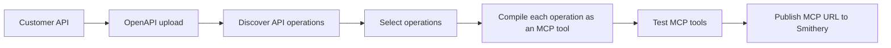
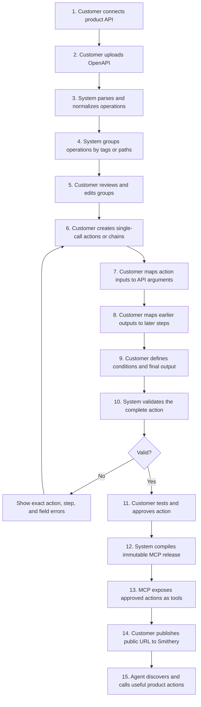
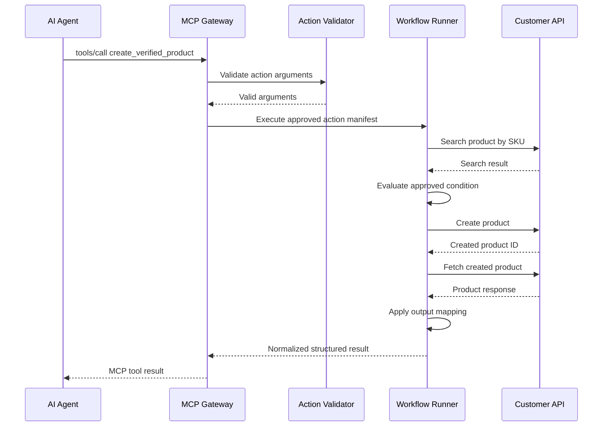

# Deterministic MCP Middle Layer

## Purpose

This document explains what exists in Product-to-MCP today, what the new
middle layer will do, and why the resulting MCP will be more valuable to AI
agents than a direct API-wrapper MCP.

This proposal does not add an AI generation layer. The customer remains in
control of tool selection, grouping, action design, chaining, field mapping,
and approval. The platform provides a deterministic builder, validator,
compiler, and runtime.

## Important distinction

The generated server will still be a standard MCP server. We are not creating
a different protocol or a custom kind of MCP.

The difference is the quality of the tools exposed through MCP:

```text
Simple API-wrapper MCP
    exposes backend endpoints as tools

Product-to-MCP with the middle layer
    exposes approved product actions as tools
```

The MCP protocol handles discovery and invocation through `tools/list` and
`tools/call`. Our middle layer determines what those tools mean, what APIs they
use, how they execute, and what result the agent receives.

## What we have today

The current deployed prototype proves the basic technical pipeline:



For example:

```text
GET    /products             -> listproducts
POST   /products             -> createproduct
PATCH  /products/{id}        -> updateproduct
DELETE /products/{id}        -> deleteproduct
```

This is useful as a working protocol and deployment prototype, but the agent
still sees the backend API design. It must understand which endpoints belong
together, choose the correct order, pass data between calls, and interpret raw
responses.

The current implementation therefore behaves mainly as an API-to-MCP wrapper.

## What we will add

We will place a deterministic Agent Action Layer between OpenAPI discovery and
MCP release generation.

```mermaid
flowchart LR
    A[Customer API] --> B[OpenAPI discovery]
    B --> C[Raw operation catalog]

    subgraph ML[Deterministic Agent Action Layer]
        D1[Group operations]
        D2[Create agent-facing actions]
        D3[Chain API operations]
        D4[Map inputs and step outputs]
        D5[Validate definitions]
        D6[Refine final responses]
        D7[Add MCP behavior annotations]

        D1 --> D2 --> D3 --> D4 --> D5 --> D6 --> D7
    end

    C --> D1
    D7 --> E[Approved action manifest]
    E --> F[Standard MCP gateway]
    F --> G[Smithery and MCP clients]
```



The layer does not guess product behavior. It provides a structured visual
builder in which the customer defines and approves the behavior.

## Complete product workflow



## What happens inside the middle layer

### 1. Normalize the OpenAPI operations

The backend converts each supported OpenAPI operation into a stable internal
record containing:

- Operation ID.
- HTTP method and path.
- OpenAPI tags.
- Description.
- Path, query, header, and request-body inputs.
- Required fields.
- Successful response schema where available.
- Read or write classification.

These operations are internal building blocks. They are not automatically
published as final MCP tools.

### 2. Organize large APIs into groups

For products with 40-50 API operations, showing one unstructured list would be
difficult to manage. The system will group operations deterministically:

1. Use the first OpenAPI tag when available.
2. Otherwise use the first stable path segment.
3. Otherwise place the operation in `General`.

Example:

```text
Product Catalog
- GET /products
- GET /products/{id}
- POST /products
- PATCH /products/{id}
- DELETE /products/{id}

Orders
- GET /orders
- GET /orders/{id}
- POST /orders/{id}/cancel
```

The customer can rename, merge, hide, reorder, or reassign these groups.

Grouping is primarily a builder and release-management feature. MCP clients
normally receive a flat tool list, so grouping will not be presented as a
protocol capability that clients may not support.

### 3. Create agent-facing actions

The customer can convert one API operation into a single-call action.

For example:

```text
Raw operation:
GET /products?query={query}&status={status}

Agent-facing action:
search_product_catalog

Purpose:
Find products using a search term and optional product status.
```

The system initializes the action from OpenAPI, and the customer reviews or
edits:

- Tool name.
- Human-readable title.
- Description of when the agent should use it.
- Inputs visible to the agent.
- Output visible to the agent.
- Read-only, destructive, and idempotency annotations.

This is still a simple action, but its contract is designed for an agent
rather than copied directly from the backend route.

### 4. Chain related API operations

The customer can combine multiple operations into one deterministic action.

Example:

```text
Action: create_verified_product

1. Search product by SKU.
2. Stop if the SKU already exists.
3. Create the product.
4. Fetch the created product.
5. Return a clean product result.
```

The agent calls only `create_verified_product`. Our backend performs the API
sequence in the approved order.

This removes API orchestration work from the agent and makes repeated
executions consistent.

### 5. Map data between the action and API calls

Every required API argument must have an explicit source. The visual builder
will support:

- Action input.
- Output from an earlier step.
- Fixed constant.
- Omitted optional value.

Example:

```text
action.sku                  -> searchProducts.query.sku
action.name                 -> createProduct.body.name
action.price                -> createProduct.body.price
createProduct.data.id       -> getProduct.path.product_id
```

Mappings use structured references. The runtime will not execute arbitrary
Python, JavaScript, templates, or user-provided code.

### 6. Apply simple execution conditions

A step may run only when an earlier result satisfies a configured condition.

Example:

```text
Run createProduct only when searchProducts.data.count equals 0.
```

The first version supports a fixed set of comparisons such as equals,
not-equals, exists, empty, and numeric comparisons. If a condition is false,
the action either skips the step or stops with a configured message.

There will be no loops, dynamic code, parallel branches, automatic retries, or
automatic rollback in this update.

### 7. Refine the response returned to the agent

Raw APIs may return large or internal responses. The customer selects the
fields that form the final action output.

Example raw response:

```json
{
  "id": "p-200",
  "name": "Growth Plan",
  "price": 79,
  "internal_notes": "Created by migration job",
  "created_by": "system-user"
}
```

Example MCP action result:

```json
{
  "product_id": "p-200",
  "name": "Growth Plan",
  "price": 79,
  "status": "created"
}
```

The agent receives a smaller, predictable result and does not need to
understand every upstream response field.

### 8. Validate before publishing

The middle layer validates that:

- Every referenced operation exists.
- Required API fields are mapped.
- Tool names are valid and unique.
- A step references only action inputs or earlier steps.
- Conditions use supported operators.
- Input and output schemas are valid.
- Output mappings reference available data.
- The action stays within execution and step limits.

Invalid actions remain drafts. The release compiler accepts only actions that
have passed validation and received customer approval.

### 9. Compile an immutable action manifest

Approved actions are converted into a runtime manifest containing:

- Agent-facing tool metadata.
- Input and output schemas.
- MCP annotations.
- Ordered API steps.
- Argument mappings.
- Conditions.
- Final output mapping.
- Snapshots of the referenced API operations.

The release is immutable. Editing an action later creates a new release and
does not change an MCP that is already deployed.

## Runtime workflow when an agent calls a tool



The runtime does not redesign the action. It executes the exact action version
approved by the customer.

## Previous system compared with the new system

| Area | Current prototype | After deterministic middle layer |
| --- | --- | --- |
| Source | Customer OpenAPI | Customer OpenAPI |
| API discovery | Supported | Improved with tags and response schemas |
| Large API handling | Flat operation list | Searchable and editable groups |
| Tool creation | One endpoint becomes one tool | User-approved actions become tools |
| Multiple API calls | Agent must coordinate them | Backend executes an approved chain |
| Input mapping | Direct endpoint arguments | Agent inputs mapped to one or more API calls |
| Conditions | Not supported | Fixed deterministic conditions |
| Responses | Mostly raw API response | Customer-defined structured output |
| Tool safety metadata | Limited | MCP read/write/destructive/idempotent hints |
| Validation | Basic operation validation | Complete action, mapping, and chain validation |
| Release | Immutable raw-tool manifest | Immutable action manifest |
| AI generation | None | None |

## Why this MCP becomes more valuable to agents

The value is not that it uses a different MCP protocol. The value is that the
MCP tool surface becomes a designed product interface for agents.

Agents receive:

- Fewer unnecessary tools when the customer publishes only required actions.
- Clearer tool names and descriptions.
- Business-level actions instead of route-level CRUD operations.
- One tool for an approved multi-call workflow.
- Predictable input and output schemas.
- Consistent failure behavior.
- Less raw response data.
- Useful read-only, destructive, and idempotency hints.

The customer receives:

- Full control without relying on AI-generated assumptions.
- A manageable interface for both small APIs and APIs with 40-50 operations.
- Reusable chains that are tested once and executed consistently.
- Visibility into every API operation used by an MCP action.
- Immutable releases that can be reviewed and versioned.

## What the customer must provide

The customer provides:

- Product name and API base URL.
- OpenAPI 3.0 or 3.1 document.
- API authentication details.
- Which operations are allowed in the MCP.
- Agent-facing action names and descriptions.
- Operations used by each action.
- Step order for chained actions.
- Input, step-output, and constant mappings.
- Simple execution conditions where needed.
- Fields included in the final response.
- Final approval before release generation.

The customer does not provide database access, executable code, or an AI
prompt that controls runtime behavior.

## Scope of this update

Included:

- Deterministic grouping from OpenAPI tags and paths.
- Search and filters for large API catalogs.
- Editable operation groups.
- Visual single-call action creation.
- Visual sequential chaining.
- Input and previous-step output mapping.
- Simple conditions.
- Output refinement.
- Action validation, testing, and approval.
- MCP tool schemas and annotations.
- Action-only releases from the updated product flow.
- Existing MCP URL and Smithery publishing flow.

Not included:

- AI-generated groups, actions, or chains.
- Direct customer database integrations.
- Arbitrary scripts or code execution.
- Loops, parallel workflow branches, rollback, or automatic retries.
- Runtime LLM decision-making inside a chain.
- Automatic publication without customer approval.

## CTO confirmation

The proposed product direction is:

> Keep Product-to-MCP API-only and deterministic. Add an action-design middle
> layer that helps customers organize OpenAPI operations, create agent-facing
> tools, combine related APIs into controlled chains, map data between steps,
> refine responses, validate the result, and publish only approved actions as
> a standard MCP server.

The points to confirm before implementation are:

1. New UI-generated releases expose approved actions instead of raw API
   operations.
2. Grouping is deterministic and editable but remains an internal management
   feature.
3. Chaining supports sequential calls and simple conditions only.
4. Customers explicitly define and approve mappings and behavior.
5. Runtime execution remains deterministic and contains no AI layer.
6. Existing deployed releases remain functional and immutable.
