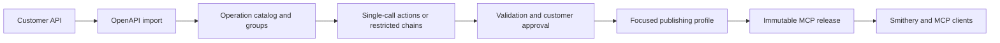
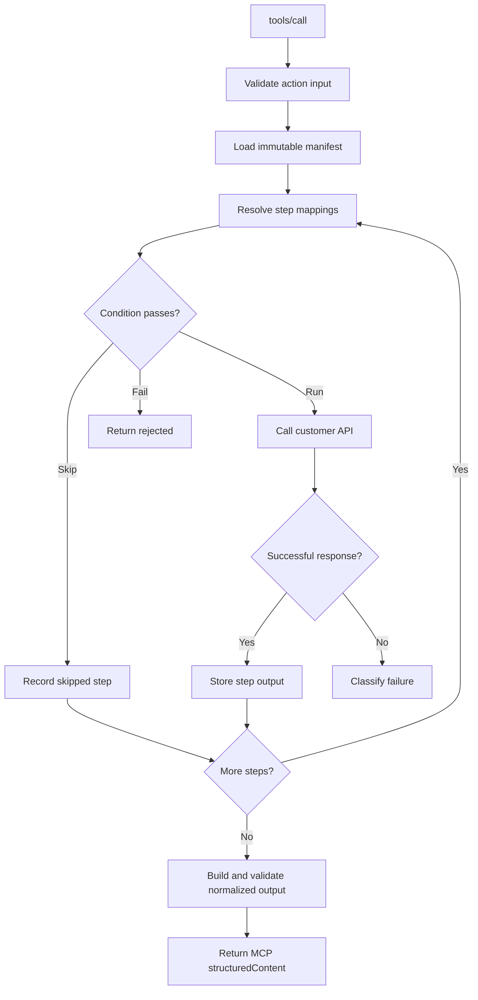

# Deterministic Action Layer: Implementation Reference

## Implemented system

Product-to-MCP now compiles customer API operations into explicit agent
actions instead of exposing every selected endpoint as a raw MCP tool.

The existing raw-operation release format remains readable and executable so
already-deployed MCP URLs continue working. New releases use an action manifest
when a publishing profile is supplied.

## OpenAPI discovery

Each operation records its method, path, tags, default group, input schema,
first successful JSON response schema, support status, and a stable fingerprint.
Local `#/components/...` references are resolved. Remote references are
rejected and are never fetched by the server.

Default groups are chosen deterministically:

1. first OpenAPI tag;
2. first non-parameter path segment;
3. `General`.

Users can search and filter a large operation catalog, rename and reorder
groups, move operations, merge groups, hide groups, and restore hidden groups.
Unsupported operations stay visible for explanation but cannot be used in an
action.

## Action definitions

An action has agent-facing metadata and JSON Schemas plus one to ten ordered
API steps. A step argument may receive a value from:

- an action input field;
- an earlier step output;
- a constant.

The UI provides schema-derived path suggestions while preserving an explicit
text path for advanced schemas. Users can start a new chain from selected
operations or add an operation to an existing draft. There are no arbitrary
scripts, templates, loops, parallel branches, or model-generated expressions.

The fixed condition operators are `equals`, `not_equals`, `exists`,
`not_exists`, `empty`, `not_empty`, and the four numeric comparison variants.
A false condition either skips the step or rejects the action.

Validation blocks approval when names, schemas, operations, required mappings,
step references, output mappings, conditions, the ten-step limit, or the
one-write limit are invalid. Editing an approved action returns it to draft.
Changing a referenced OpenAPI operation also invalidates the editable action,
while existing releases remain unchanged.

## Runtime execution

`ActionExecutor` runs above the existing upstream HTTP executor:

Default limits are 20 seconds per upstream call, 60 seconds per action, 2 MB
per upstream response, ten steps, and one write. No automatic retries or
rollbacks occur.

Runtime outcomes are `success`, `rejected`, `failed`, `partial_success`, and
`outcome_unknown`. A write timeout or disconnect is `outcome_unknown`; a
successful write followed by a failed verification read is `partial_success`.
Both are always marked `retry_safe: false`.

The product test endpoint returns a redacted step trace. Public MCP
`tools/call` responses do not include internal traces or credentials.

## Profiles and MCP releases

A publishing profile stores an explicit list of approved action IDs. Adding a
group resolves it immediately to action IDs, so later group changes cannot
silently add tools. Profiles above 20 tools show a warning; profiles above 30
require explicit release confirmation.

Every release snapshots its actions and referenced operations, calculates a
manifest hash, and receives a separate MCP URL. `tools/list` exposes only that
profile's actions with `title`, description, input/output schemas, and MCP tool
annotations. `tools/call` returns both JSON text content and normalized
`structuredContent` for client compatibility.

The gateway retains MCP protocol version `2025-06-18` and Streamable HTTP
behavior.

## Control-plane APIs

- `GET /v1/projects/{id}/workspace`
- `GET|PUT /v1/projects/{id}/groups`
- CRUD plus `validate`, `approve`, and `test` under
  `/v1/projects/{id}/actions`
- CRUD under `/v1/projects/{id}/profiles`
- `POST /v1/projects/{id}/releases` with `profile_id`
- existing release testing and Smithery publishing endpoints

Legacy no-body release creation is controlled by
`PRODUCT_TO_MCP_ALLOW_LEGACY_RELEASES`. Disabling it does not disable existing
legacy release URLs.

## Storage and compatibility

SQLite is used locally and PostgreSQL is supported for hosted platform state.
Additive startup migrations create `schema_migrations`, operation-group,
action, and profile tables and add nullable `profile_id` to releases. Existing
`tools_json` manifests are not rewritten.

Before a hosted rollout, back up PostgreSQL, deploy the backend first with
legacy release creation enabled, smoke-test existing MCP URLs, deploy the
frontend, verify an action release through Smithery, and only then disable new
legacy release creation.

## Verification coverage

Backend tests cover enriched OpenAPI discovery, 50-operation import,
fingerprints, unsupported operations, idempotent SQLite migration, grouping,
action validation, conditional dependencies, read-write-read execution,
optional mappings, ambiguous write outcomes, profile releases, MCP tool lists,
and OpenAPI invalidation without release mutation.

Frontend component tests cover 50-operation search, group moves and merging,
validation errors, operation addition, step ordering, and large-profile
confirmation. The Playwright acceptance flow imports the physical 50-operation
fixture, approves an action, creates a focused profile, and generates a release.

Full public SaaS readiness still requires user/organization authorization,
MCP OAuth, tenant isolation, managed secret storage, rate limits, audit logs,
observability, backup/restore procedures, and Smithery deployment status
persistence. These remain outside this deterministic action-layer update.
